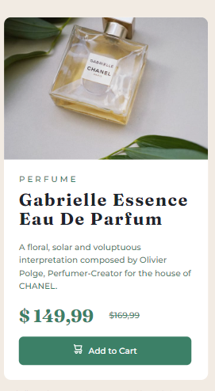

# Frontend Mentor - Product preview card component solution

This is a solution to the [Product preview card component challenge on Frontend Mentor](https://www.frontendmentor.io/challenges/product-preview-card-component-GO7UmttRfa).

## Table of contents

- [Overview](#overview)
  - [The challenge](#the-challenge)
  - [Screenshot](#screenshot)
- [My process](#my-process)
  - [Built with](#built-with)
  - [What I learned](#what-i-learned)
- [Author](#author)
- [Acknowledgments](#acknowledgments)

## Overview

### The challenge

Users should be able to:

- View the optimal layout depending on their device's screen size
- See hover and focus states for interactive elements

### Screenshot




## My process

### Built with

- Semantic HTML5 markup
- CSS custom properties
- Flexbox
- CSS Grid
- Mobile-first workflow

### What I learned

- That project made me learn about semantic HTML5 in the right use of the tag `<picture>` and how significant its use can be to the viewport and data consume to the user in the matter of adaptative device's size of screen.

```html
<picture class="image-parfum">
  <source
    srcset="./src/images/image-product-desktop.jpg"
    media="(min-width: 769px)"
  />
  
</picture>
```

- Working with flexible display using the flexbox properties, positioning elements on the screen.

- Working yet with positionin elements on screen with CSS Grid too.

- Working with external fonts (Google fonts) to improve a better custom apparence.

- Working with separated documents, improving organization and responsability to every document with its function in the whole project.

```html
<link rel="stylesheet" href="src/styles/reset.css" />
<link rel="stylesheet" href="src/styles/variables.css" />
<link rel="stylesheet" href="src/styles/style.css" />
<link rel="stylesheet" href="src/styles/responsible.css" />
```

- Working with variables reducing the code and establishing a pattern easiest to manage.

```CSS
:root {
    /* primary */
  --dark-cyan: hsl(158, 36%, 37%);
  --cream: hsl(30, 38%, 92%);
    /* neutral */
  --very-dark-blue: hsl(212, 21%, 14%);
  --dark-grayish-blue: hsl(228, 12%, 48%);
  --white: hsl(0, 0%, 100%);
    /* font-size */
  --paragraph: 14px;
    /* font-family */
  --font-text: "Montserrat", sans-serif;
  --font-heading: "Fraunces", serif;
}
```

## Author

- Github - [Michel Moreira](https://github.com/michel-moreira)
- Frontend Mentor - [@michel-moreira](https://www.frontendmentor.io/profile/michel-moreira)
- LinkedIn - [Michel Moreira](https://www.linkedin.com/in/michel-moreira-760142254/)

## Acknowledgments

To the team of users from the Frontend Mentor that helped me with useful suggestions and feedbacks, promoting an excitement and happiness in the matter of coding.
To my personal sponsors (family and friends).
To everybody that love coding my whole gratitude.
